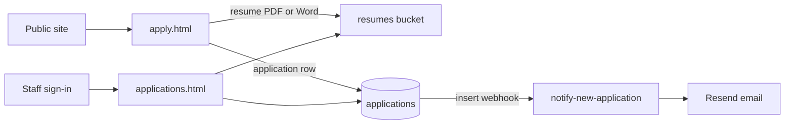

# KornerMart

Static website and hiring pipeline for KornerMart, a family-owned chain of gas stations and convenience stores across Southern Utah. The public site covers who we are, twelve store locations, a coming-soon KM Rewards section, and open roles. Candidates apply once for every position they want; staff review those applications in a private inbox.

Live site: [kornermart.com](https://kornermart.com)

---

## Screenshots

**Employment application** — one form, multiple roles, privacy notice at the top.


**Hiring inbox** — signed-in staff see counts, filters, and a selected applicant on the right.


**Application questions** — yes/no answers sit next to the list. Answers that need a closer look (for example a criminal-history “Yes”) show in red.


---

## What we built

Work went in this order:

1. **Public marketing site** — floating nav, hero with sample fuel prices, Who We Are, a location grid with directions, KM Rewards (coming soon, with a points calculator), and a Careers section that lists every opening.
2. **Employment application** — `apply.html` collects contact info, address, roles, availability, preferred store, optional resume, screening questions, education, and employment history.
3. **Legal pages** — Privacy Policy and Terms & Conditions, linked from the apply form and the site footer.
4. **Supabase backend** — `applications` and `locations` tables, row-level security, and a private `resumes` storage bucket.
5. **Staff hiring inbox** — password login, applicant list, detail pane, status changes, resume download, and CSV export.
6. **Email alerts** — a Supabase Edge Function formats each new application and sends it through Resend to `kornermart@gmail.com`.

Jobs and stores live in one shared file (`jobs.js`) so the homepage, apply form, and database stay in sync.

---

## How hiring works



1. A candidate opens **Apply now** from Careers (or a specific role, which pre-checks that job on the form).
2. The browser talks to Supabase with the public anon key. The resume goes into a private bucket; the rest of the form becomes one row in `applications`.
3. An insert webhook calls `notify-new-application`, which emails the hiring inbox a formatted summary plus a 7-day signed resume link.
4. Staff open `/applications.html` (not linked from the public site), sign in, and work the list: New → Reviewed → Interview, or Archive.

Anonymous visitors can **insert** applications and **upload** resumes. They cannot read other people’s rows or files. Only an authenticated staff user can list applications, update status, and open resumes.

---

## Public website

`index.html` is the company homepage.

| Section | What it does |
| --- | --- |
| Hero | Brand line, sample fuel board, links to stores and rewards |
| Who We Are | Family-owned story, values, city/location counts |
| Locations | Twelve stores from `jobs.js`, each with a Maps directions link |
| KM Rewards | Coming soon — Member / KM Plus / KM Fleet tiers and a gallons-per-week calculator |
| Careers | Role cards that deep-link into `apply.html?job=…` |

The page uses the KM blue/red palette (Sora + Instrument Sans), a glass nav, and a decorative bubble canvas. Rewards enrollment buttons toast “coming soon” instead of collecting sign-ups.

---

## Employment application

`apply.html` is a single application for every role. Candidates check every position they want, plus full-time and/or part-time, and pick a preferred store from the same twelve locations.

The form includes:

- Contact name, phone, email, and mailing address
- Positions (Regional Manager, General Manager, Assistant Manager, Office Administrator, Facilities Maintenance Technician, Cashier, plus Other)
- Optional resume — PDF or Word, 10 MB max
- Screening questions (transportation, 21+, work authorization, drug test, essential functions / ADA note, criminal history)
- Education, extra skills, current employment, and whether we may contact the employer
- Required Terms & Conditions checkbox and optional marketing opt-in
- A hidden honeypot field so basic bots never write a row

On success the form is replaced with a thank-you that repeats the roles, store, and email we will use. Data handling is described on [privacy.html](privacy.html); the certification language is on [terms.html](terms.html).

---

## Hiring inbox

`applications.html` + `applications.js` is the staff tool. There is no public sign-up; accounts are created in the Supabase Auth dashboard.

What staff can do:

- See totals: all applications, new this week, interviewing, with a resume
- Search by name, email, or position; filter by store, role, and status; sort columns
- Toggle stats and compact rows (saved in `localStorage`)
- Open a row to read contact info, roles, availability, questions, education, and certification
- Opening a **New** row marks it **Reviewed**
- **Move to interview**, **Archive**, or **Email** (mailto with the role in the subject)
- Open or download the real resume via a short-lived signed URL (the on-screen resume card is a styled preview, not a live PDF)
- Export the current filtered list as CSV

Statuses: **New** → **Reviewed** → **Interview**, or **Archived**.

The inbox is `noindex` and is not linked from the public nav. Bookmark `https://kornermart.com/applications.html` after the first sign-in.

---

## Database and storage

Schema lives in [`supabase/schema.sql`](supabase/schema.sql). Apply it in the Supabase SQL editor.

**`locations`** — store code, name, address, sort order. Public read so the apply form can stay aligned with the site.

**`applications`** — one row per submission. Notable fields:

- `positions` and `availability` as text arrays
- Store as `location_code` (FK) plus name/address; `preferred_location` is generated
- `full_name` is generated from first / middle / last
- Screening answers as `Y` / `N` plus optional notes
- `resume_path` / `resume_filename` pointing at Storage
- `status` defaulting to `New`
- `terms_accepted` and `marketing_opt_in`

**Storage bucket `resumes`** — private, 10 MB, PDF and Word only. Public (anon) can upload. Authenticated staff can read. Signed URLs are used for email links (7 days) and the inbox (1 hour).

**Row-level security**

| Who | Applications | Resumes |
| --- | --- | --- |
| Anonymous | Insert only | Upload only |
| Authenticated staff | Select and update | Read |

Never put the `service_role` key in frontend files. The browser only gets the anon/publishable key from `supabase-config.js`.

---

## New-application email

[`supabase/functions/notify-new-application`](supabase/functions/notify-new-application/index.ts) builds an HTML email that matches the inbox: contact, positions, resume link, questions, education, and a button to open the hiring inbox.

Typical wiring:

1. Deploy the function.
2. Set secrets: `RESEND_API_KEY`, and optionally `RESEND_FROM` (defaults to `KornerMart Hiring <careers@kornermart.com>`).
3. Database → Webhooks → fire on **insert** to `public.applications`.

The function loads the full row with the service role (server-side only) so the email can include a signed resume URL.

---

## Project files

```
index.html              Public homepage
apply.html              Employment application
applications.html       Staff inbox shell
applications.js         Inbox login, list, detail, status, CSV
jobs.js                 Shared openings and store list
privacy.html            Privacy Policy
terms.html              Terms & Conditions
supabase-config.js      Live anon URL + key (do not add service_role)
supabase-config.example.js
supabase/schema.sql     Tables, RLS, storage policies
supabase/functions/notify-new-application/
Images/                 Product screenshots used in this README
```

---

## Local setup

The site is static HTML, CSS, and JS. Open the files locally or serve the folder (any static host, including GitHub Pages or the current kornermart.com host).

1. Copy `supabase-config.example.js` to `supabase-config.js`.
2. Paste the project URL and **anon / publishable** key from Supabase → Project Settings → API Keys.
3. Run `supabase/schema.sql` against the project if tables are not already there.
4. Create a staff user in Authentication → Users (email + password). That account is what signs into the hiring inbox.
5. Deploy `notify-new-application` and attach the insert webhook if email alerts should keep running.

To add or rename a job or store, edit `jobs.js` and, for stores, keep `locations` in `schema.sql` in agreement so the foreign key still matches.

---

## Stack

- Static HTML / CSS / JS (no build step)
- [Supabase](https://supabase.com) — Postgres, Auth, Storage, Edge Functions
- [supabase-js](https://github.com/supabase/supabase-js) from CDN on apply + inbox pages
- [Resend](https://resend.com) for hiring emails
- Google Fonts: Sora, Instrument Sans, Space Grotesk
